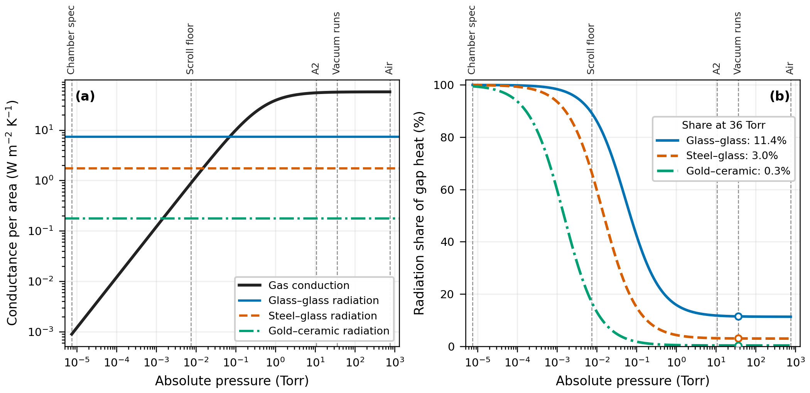
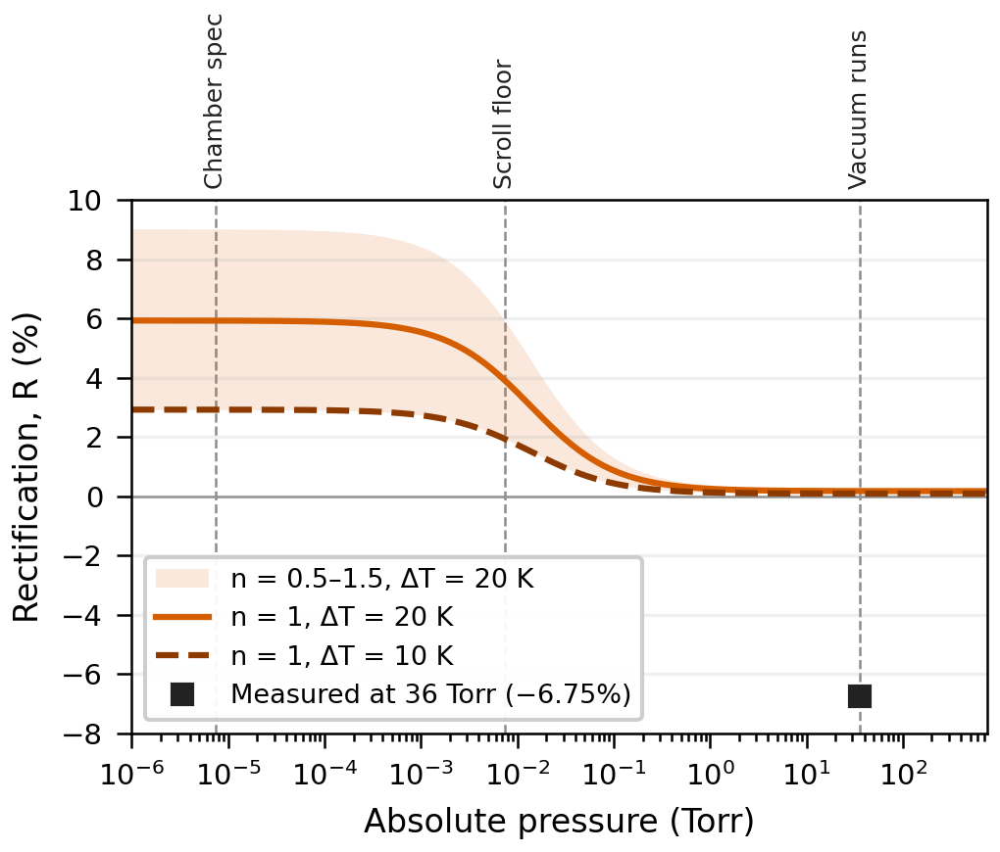

# simulations/

Physics simulations of the 508 µm steel–glass gap, written for the TJAS 2026 paper. They test how much of the gap heat radiation carries at the pressure used in the vacuum runs, and how much rectification the gap itself can produce. Neither script reads the raw data in `../data/`; both are first-principles models of the gap.

| Sim | Question it answers | Script | Status |
|---|---|---|---|
| 1 | How much of the gap heat does radiation carry at 36 Torr, and what pressure makes radiation dominant? | `sim1_pressure.py` | In the TJAS paper |
| 2 | How much rectification can the gap itself produce, and in which direction? | `sim2_gap_rectification.py` | In the TJAS paper |
| 3 | Can a full-stack thermal model reproduce the measured η values? | coming later | For the Oct 8 talk |

## Key results

**Sim 1.** The vacuum-gauge reading of 28.5 inHg corresponds to about 36 Torr absolute. At that pressure the mean free path of air is about 1.6 µm, still about 300 times smaller than the 508 µm gap, so gas conduction stays at 98.8% of its value in air. Radiation therefore carries only a small share of the gap heat:

| Surface pair | Radiation share at 36 Torr | 50% at | 90% at |
|---|---|---|---|
| Glass–glass | 11.4% | 0.070 Torr | 6.9 × 10⁻³ Torr |
| Steel–glass | 3.0% | 0.015 Torr | 1.6 × 10⁻³ Torr |
| Gold–ceramic | 0.3% | 1.5 × 10⁻³ Torr | 1.7 × 10⁻⁴ Torr |

**Sim 2.** With constant emissivities, emissivity contrast alone gives exactly zero rectification: ε_eff is the same number in both directions. If the steel's emissivity changes with temperature, the gap gives a few percent in hard vacuum, with a definite sign. At 36 Torr the gap alone gives at most about +0.26%, compared with the measured −6.75%. For steel whose emissivity rises with temperature, the model's sign is opposite to the measured sign. The measured asymmetry therefore needs an explanation beyond gap radiation; Sim 3 is built to find it.





## How to run

Requires Python 3.10 or newer.

```bash
cd simulations
pip install -r requirements.txt
python sim1_pressure.py
python sim2_gap_rectification.py
```

Run without `-O`: every check in the simulation spec is an `assert`, and the scripts refuse to run if asserts are disabled. Each script stops at the first failed check. When both finish, they print `PASS` for every stage and rewrite `results/` and `figures/`.

## Files

| Path | Contents |
|---|---|
| `mgtd_common.py` | Constants, unit conversions and shared physics (ε_eff, G_rad, gas conductance) |
| `mgtd_plotstyle.py` | Shared figure style and export (PNG 300 DPI, PDF, SVG) |
| `sim1_pressure.py` | Sim 1: gap heat transfer vs. pressure |
| `sim2_gap_rectification.py` | Sim 2: gap-only forward/reverse rectification |
| `results/` | CSV tables of every number quoted in the paper |
| `figures/` | Paper figures |

## Model assumptions

- Gray, parallel, infinite plates; 508 µm gap; mean gap temperature 340 K.
- Gas conduction across all pressures uses the series interpolation between the continuum and free-molecular limits (accommodation coefficient 0.9). This is an interpolation, not an exact transition-regime solution.
- Air conductivity k(T) = 0.0263 × (T / 300 K)^0.8 W/m·K.
- Sim 2 fixes the two gap surfaces at T̄ ± ΔT/2. Steel emissivity is modeled as 0.20 × (T / T̄)^n, and n is swept because it has not been measured.

## License and citation

Covered by the repository's GPL-3.0 license (`../LICENSE`). To cite the version used in the TJAS paper:

> Swaminathan, N. (2026). *Micro-gap thermal diode: simulations* (Version v1.0-tjas) [Computer software]. GitHub. https://github.com/nikhi-s/microgap-thermal/tree/v1.0-tjas/simulations
