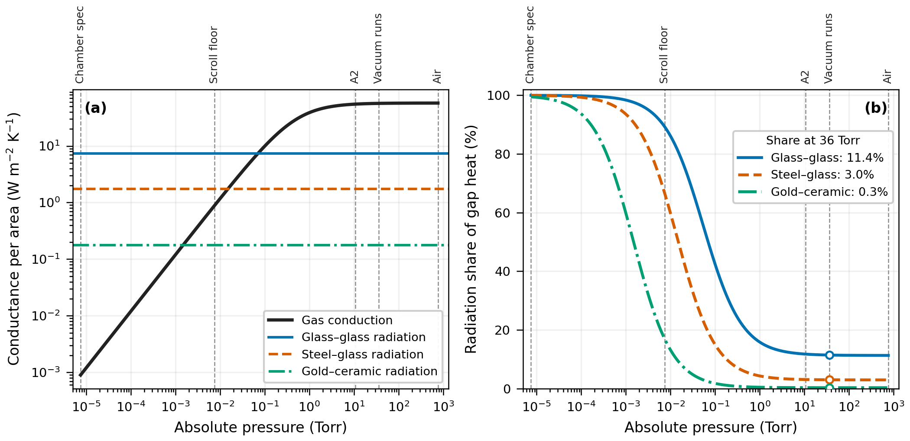
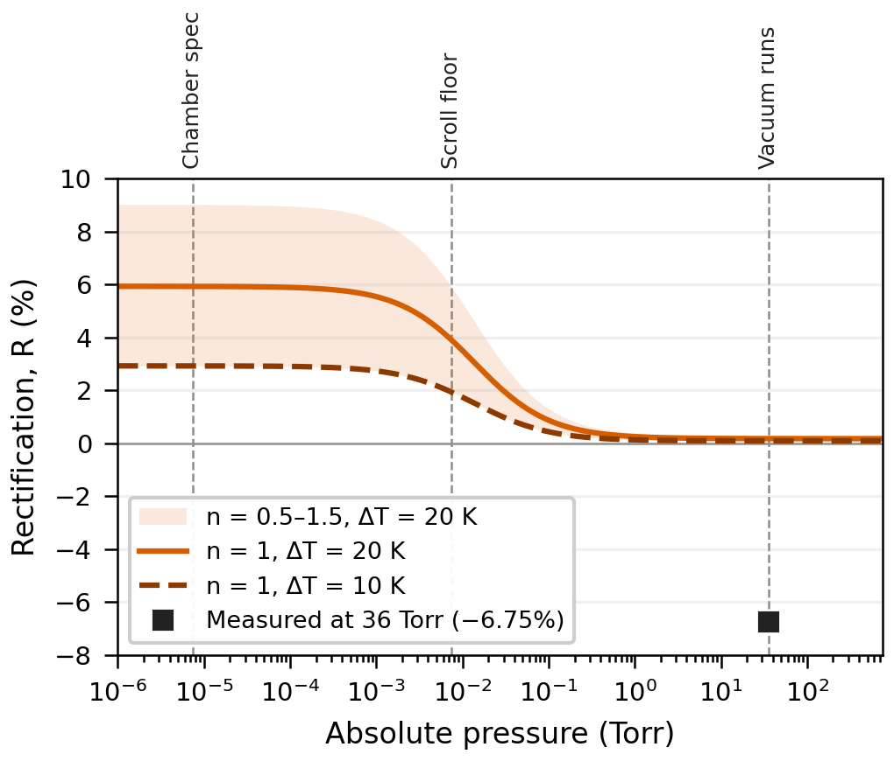

# simulations/

Physics simulations of the 508 µm steel–glass gap, written for the TJAS 2026 paper. They test how much of the gap heat radiation carries at the pressure used in the partial-vacuum runs, and how much rectification the gap itself can produce. Neither script reads the raw data in `../data/`; both are first-principles models of the gap.

| Sim | Question it answers | Script | Status |
|---|---|---|---|
| 1 | How much of the gap heat does radiation carry at the February run pressure, and what pressure makes radiation dominant? | `sim1_pressure.py` | In the TJAS paper |
| 2 | How much rectification can the gap itself produce, and in which direction? | `sim2_gap_rectification.py` | In the TJAS paper |
| 3 | Can a full-stack model (constant-voltage heating, TEG Seebeck temperature dependence, lateral losses) reproduce the measured asymmetry on *both* metrics and its window dependence? | coming later | For the Oct 8 talk |

## Key results

**Sim 1.** A vacuum-gauge reading of 28.5 inHg corresponds to about 36 Torr absolute at sea-level air pressure; allowing for local air pressure in Allen, TX (~29.2 inHg) and gauge accuracy (~±1 inHg), the February runs were at roughly 15–40 Torr. Across that whole range the mean free path of air (~1.6 µm at 36 Torr) is hundreds of times smaller than the 508 µm gap, so gas conduction stays at about 99% of its value in air. Radiation therefore carries only a small share of the gap heat:

| Surface pair | Radiation share at 36 Torr | 50% at | 90% at |
|---|---|---|---|
| Glass–glass | 11.4% | 0.070 Torr | 6.9 × 10⁻³ Torr |
| Steel–glass | 3.0% | 0.015 Torr | 1.6 × 10⁻³ Torr |
| Gold–ceramic | 0.3% | 1.5 × 10⁻³ Torr | 1.7 × 10⁻⁴ Torr |

**Sim 2.** With constant emissivities, emissivity contrast alone gives exactly zero rectification: ε_eff is the same number in both directions. If the steel's emissivity changes with temperature (ε ∝ T^n), the gap gives a few percent in hard vacuum, with a definite sign. At 36 Torr the gap alone gives at most about 0.3% at ΔT = 20 K and about 1% even at ΔT = 60 K (n = 2). The February measurements gave asymmetries of 1–17% on the through-gap metric and 2–6% of the opposite sign on the sum metric (see `../analysis/paper_figures.py`, Fig 10 in the paper). Gap radiation cannot produce either; because the measured sign depends on the metric, no comparison of signs is made. Sim 3 is built to identify the source.





## How to run

Requires Python 3.10 or newer.

```bash
cd simulations
pip install -r requirements.txt
python sim1_pressure.py
python sim2_gap_rectification.py
```

Run without `-O`: every check in the simulation spec is an `assert`, and the scripts refuse to run if asserts are disabled. Each script stops at the first failed check. When both finish, they print `PASS` for every stage and rewrite `results/` and `figures/`.

## Files

| Path | Contents |
|---|---|
| `mgtd_common.py` | Constants, unit conversions and shared physics (ε_eff, G_rad, gas conductance) |
| `mgtd_plotstyle.py` | Shared figure style and export (PNG 300 DPI, PDF, SVG); also used by `../analysis/paper_figures.py` |
| `sim1_pressure.py` | Sim 1: gap heat transfer vs. pressure |
| `sim2_gap_rectification.py` | Sim 2: gap-only forward/reverse rectification |
| `results/` | CSV tables of every number quoted in the paper |
| `figures/` | Simulation figures |

## Model assumptions

- Gray, parallel, infinite plates; 508 µm gap; mean gap temperature 340 K.
- Gas conduction across all pressures uses the series interpolation between the continuum and free-molecular limits (accommodation coefficient 0.9). This is an interpolation, not an exact transition-regime solution.
- Air conductivity k(T) = 0.0263 × (T / 300 K)^0.8 W/m·K (0.0291 at 340 K). The paper's Section 2.7 hand calculation should use the same value.
- `gauge_to_abs_torr` assumes sea-level air pressure (29.92 inHg); see the pressure range above.
- Sim 2 fixes the two gap surfaces at T̄ ± ΔT/2. This bounds what the gap itself can do; it is not a prediction of the TEG readings, which come from a constant-voltage stack (Sim 3). Steel emissivity is modeled as 0.20 × (T / T̄)^n, and n is swept because it has not been measured.

## License and citation

Covered by the repository's GPL-3.0 license (`../LICENSE`). To cite the version used in the TJAS paper:

> Swaminathan, N. (2026). *Micro-gap thermal diode: simulations* (Version v1.0-tjas) [Computer software]. GitHub. https://github.com/nikhi-s/microgap-thermal/tree/v1.0-tjas/simulations
